# Sunderplace

Marketplace for TTRPG ambience and sound-effect packs. v1 sells operator-curated [Stable Audio 3](https://stability.ai/) tracks (prompt craft + human review). There is no subscription: pay **X** for a snapshot of a pack version, or **Y** for a one-time update pass. Ten free starter packs (30 tracks each) cover the most-used ambience and FX categories.

Generate locally with [Thunder FX](https://github.com/Almantask/thunder-fx), classify with [Sunder](https://github.com/Almantask/sunder), mix in [Arcanum Audio](https://almantask.github.io/rpg-audio-mixer-web/).

## Current features

- **Catalog & featured packs** — browse live packs, filter by kind, category, mood, instrument, and search, and see featured listings ranked by unique downloads and purchases in the last 30 days.
- **Full-track previews** — play the designated preview track (track 01) in full before claiming or buying a pack.
- **One-time licenses** — free packs go straight to your library; paid packs use Stripe Checkout for a snapshot, an update pass, or a snapshot-to-update-pass upgrade (you only pay the difference).
- **Library & downloads** — signed-in buyers keep entitlements, download the version they own, and revoke sessions with **Sign out** or **Sign out everywhere**.
- **Accounts** — email/password sign-up and sign-in, plus GitHub OAuth. Sessions last 7 days with a 24-hour idle timeout.
- **Ecosystem** — links to Thunder FX, Sunder, and Arcanum Audio, with one-time donations (Stripe when configured, GitHub Sponsors, or Ko-fi).
- **FAQ & feedback** — marketplace FAQ covering intensity levels, licensing, and previews; optional-name feedback form stored in D1.
- **Operator admin** — create and edit packs, set listing status and prices, add/remove tracks, upload preview audio and zip archives. Drafts stay hidden until published; live packs need at least 30 themed tracks. Duplicate SHA-256 matches are rejected catalog-wide.

## Screenshots

### Home

Featured packs, AI disclosure, and shortcuts into the catalog, FAQ, and ecosystem.

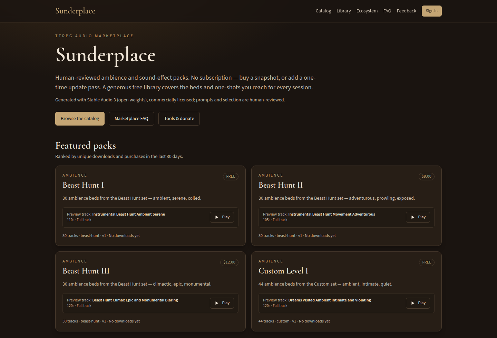

### Catalog

Filter packs by kind, category, mood, and instruments. Each card shows price, track count, and a playable preview.

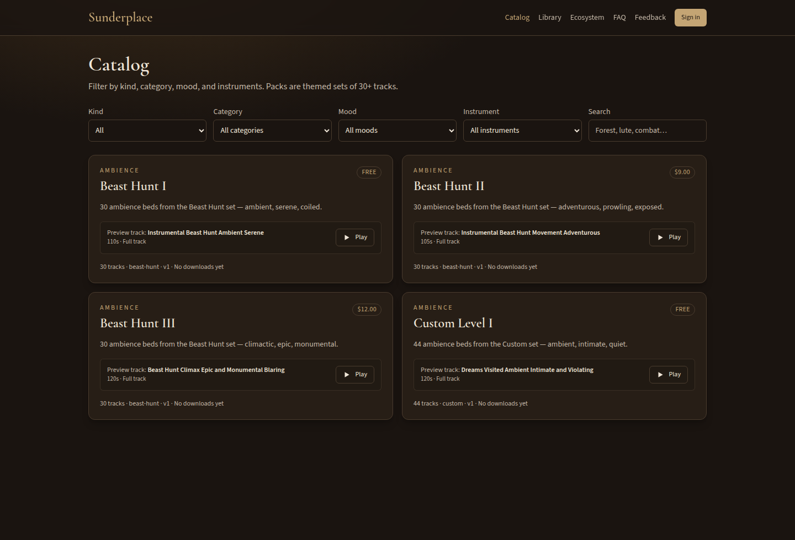

### Pack — free

Claim a free pack or download the current version. The preview track plays in full; the rest unlock with the pack.

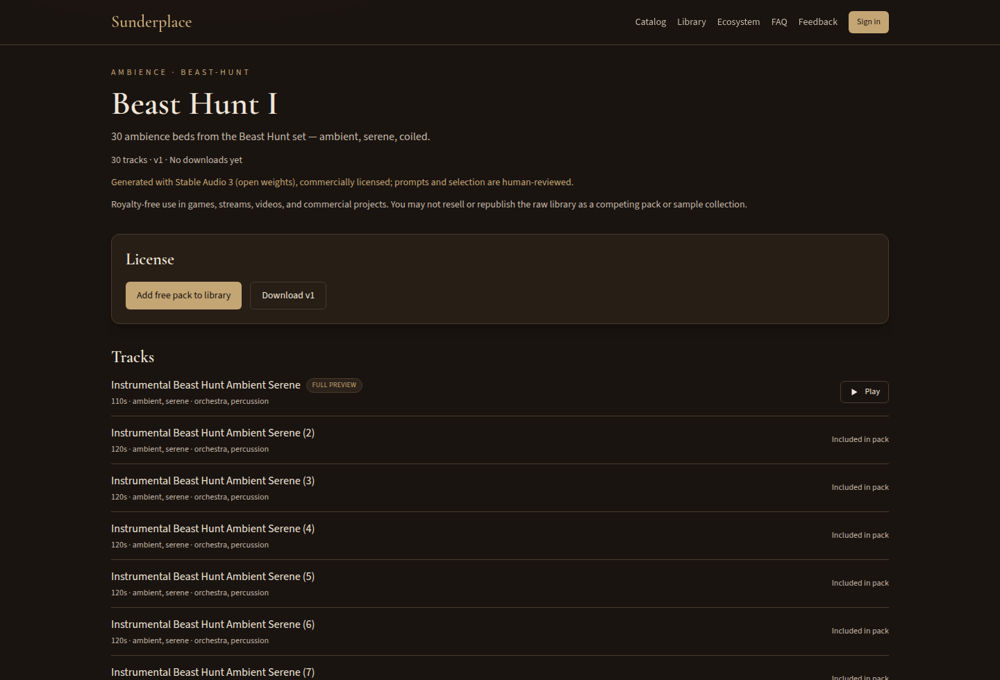

### Pack — paid

Buy a snapshot of this version, or a one-time update pass that includes later releases.

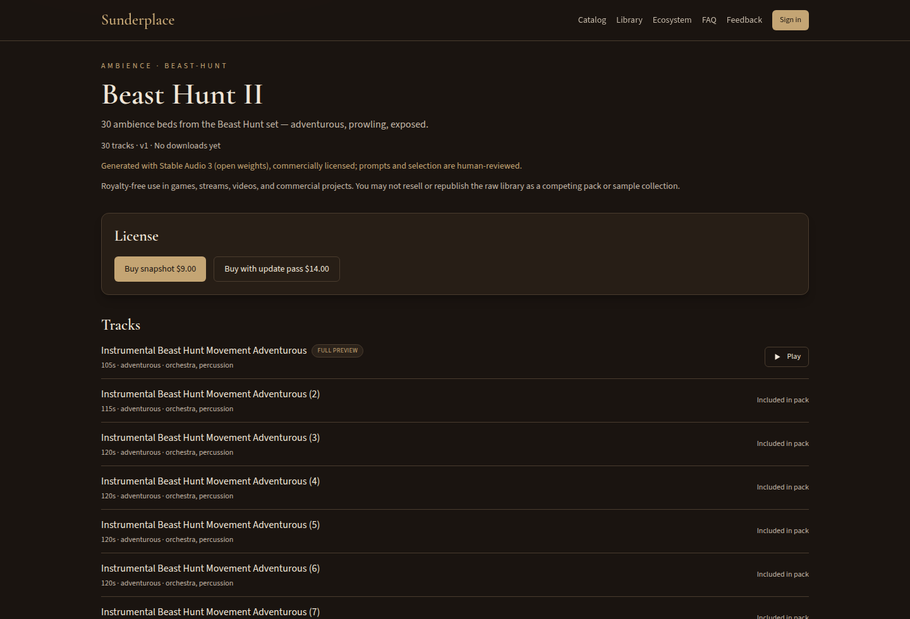

### Sign in

Email/password sign-in and sign-up, or continue with GitHub.

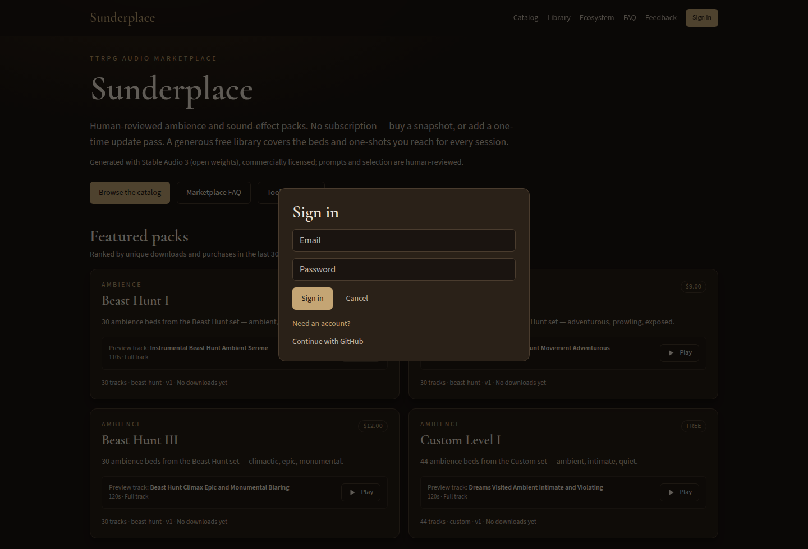

### Library

Owned packs with snapshot vs update-pass licenses and version-aware downloads.

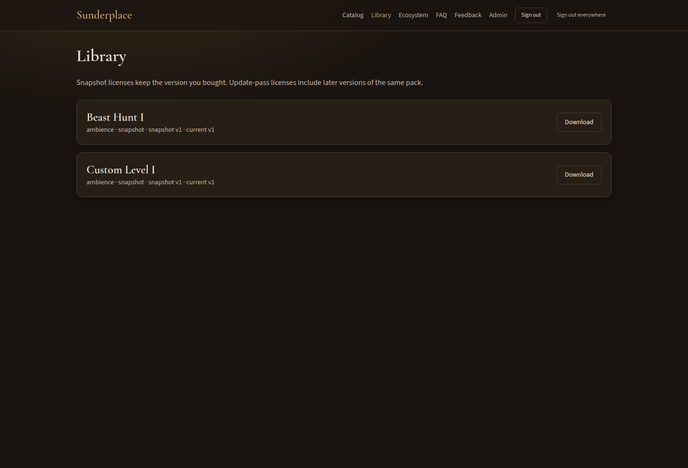

### Ecosystem

Open tools for generation, tagging, and live mixing, plus one-time donations.

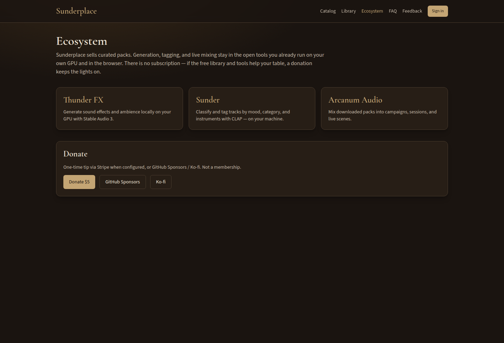

### FAQ

Intended use, Arcanum Audio intensity levels, preview policy, and licensing.

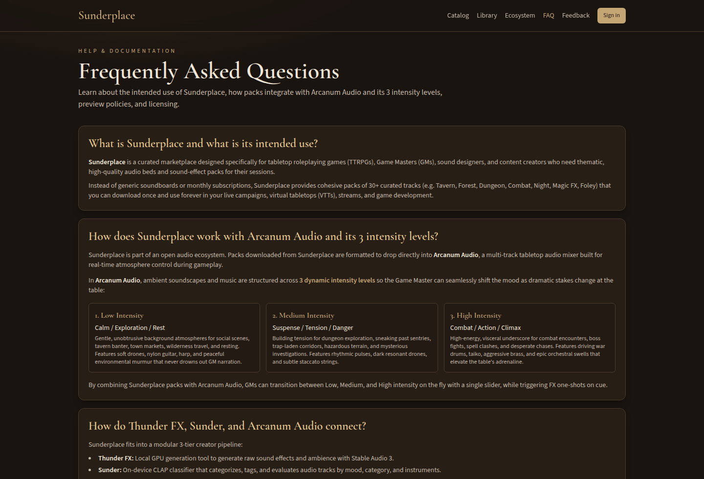

### Feedback

Send a bug, pack idea, or question. Sign-in is optional.

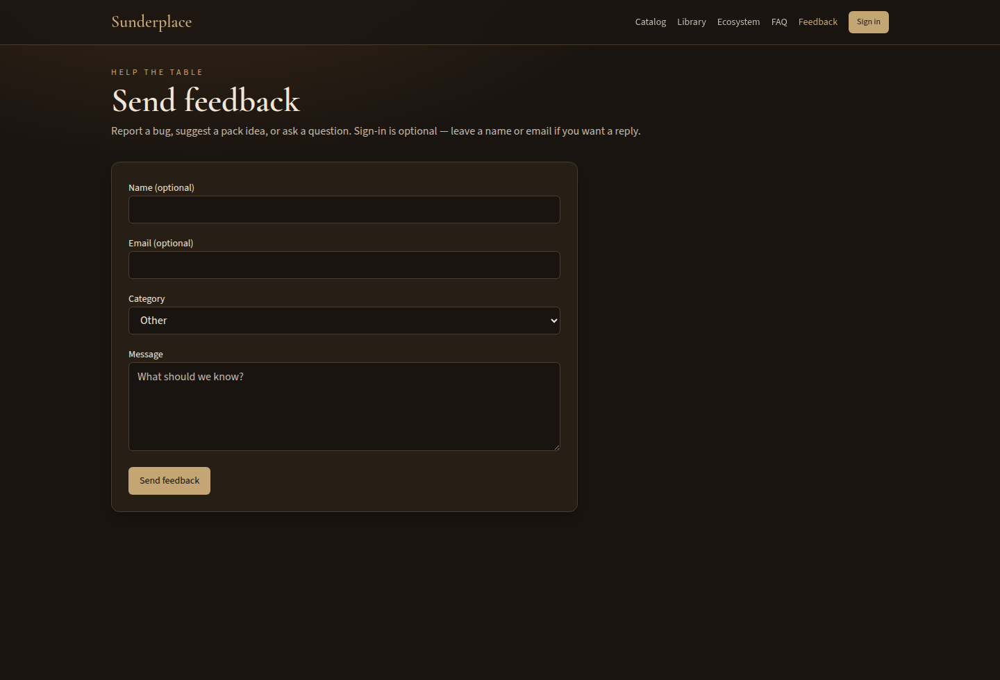

### Admin

Operator catalog: create packs, set snapshot / update-pass prices, and manage listing status (draft, pending review, live).

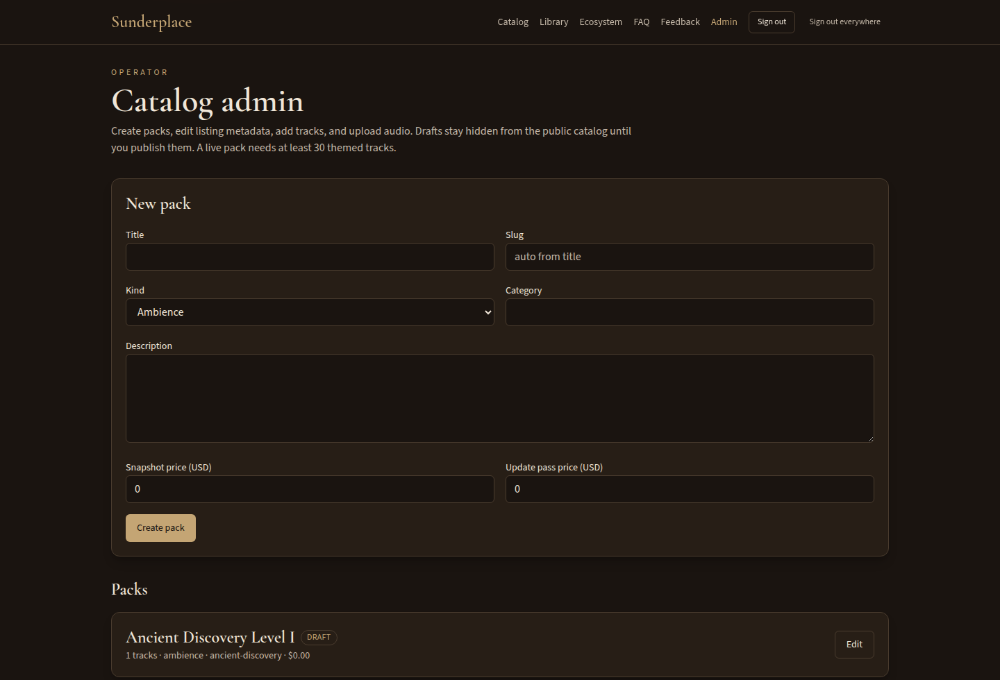

### Admin pack editor

Edit listing metadata, changelog, featured eligibility, and publish state.

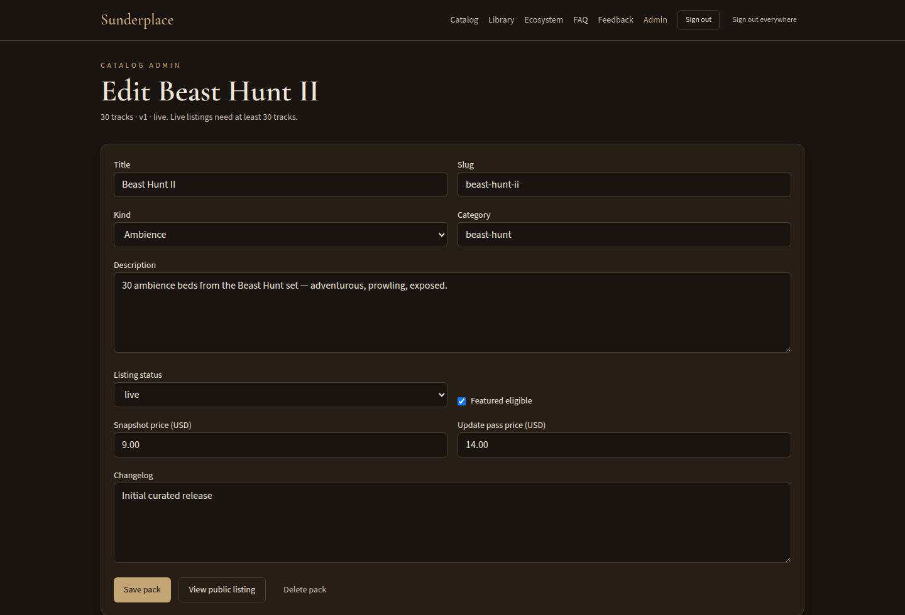

## Demo catalogue

The seeded catalogue is generated from a local Thunder FX render library rather than
hand-written fixtures, so track names, durations, and tags are real.

```bash
npm run demo:build -- --dir "E:/Music-And-Fx-Generated-Library"
```

The script walks `<kind>/<category>/<set>/*.wav`, reads the true duration from each WAV
header (the length baked into the file name is the *requested* one and is often wrong),
derives moods and instruments from the prompt slugs, and writes
`shared/demo-library.generated.ts`. It then encodes one preview per listable pack with
ffmpeg and uploads it to the local R2 bucket. Add `--skip-encode` / `--skip-upload` to
regenerate metadata only.

Packs keep the real marketplace policy: only a set with at least `MIN_LIVE_TRACKS` (30)
tracks is seeded `live`. Smaller sets land as `pending_review` or `draft`, so the operator
queue has genuine content in it. Only the previews that were actually uploaded carry an R2
key, so a pack with no ingested audio reports no preview instead of a play button that 404s;
pack archives are not staged, so downloads answer 409 until the operator CLI runs.

Reseeding needs a fresh worker process, because seeding is memoised per isolate:

```bash
npm run demo:reset && npm run dev:full
```

## Stack

Vite + React 19 + TypeScript + Tailwind 4, Hono on Cloudflare Workers, D1, R2.

## Develop

Node 22+. Copy `.dev.vars.example` to `.dev.vars`.

```bash
npm install
npm test
npm run typecheck
npm run lint
npm run dev:full
```

- UI: http://127.0.0.1:5173
- API: http://127.0.0.1:8787 (`/api/...`)

Put `SESSION_SECRET` and optional `ALLOW_DEV_LOGIN=1` in `.dev.vars` only — never in `wrangler.toml`. Deploy with `wrangler deploy --env production`; the worker refuses to serve if `APP_URL` is still loopback or non-https once `STRIPE_SECRET_KEY` is set, since that combination silently drops the `Secure` cookie flag and rejects every CORS origin. Unpaid local grants and “any user is admin” work only when **both** `APP_URL` and the incoming request host are loopback, and Stripe keys are unset. Production must set `APP_URL` to the public `https://` origin. Set `STRIPE_SECRET_KEY` and `STRIPE_WEBHOOK_SECRET` for real Checkout. Production admin is a verified email in `ADMIN_EMAILS` (GitHub sign-in) or `OPERATOR_TOKEN`. Sessions last 7 days with a 24-hour idle timeout; **Sign out everywhere** revokes every device.

To refresh the README screenshots against a running local app:

```bash
npm install --no-save puppeteer-core
node scripts/capture-readme-screenshots.mjs
```

## Operator ingest

```bash
npm run ingest -- --dir ./my-pack --slug tavern-ambience --title Tavern --kind ambience --category tavern --csv results.csv --hashes catalog-hashes.txt
```

Writes `ingest-output/pack.json` and `pack.zip`. Upload objects to R2 using `r2-keys.txt`. Packs must contain at least 30 themed tracks. Exact SHA-256 matches against `--hashes` are rejected (catalog-wide duplicate policy).

## License

Application source: Apache-2.0. Audio packs are not open source.
